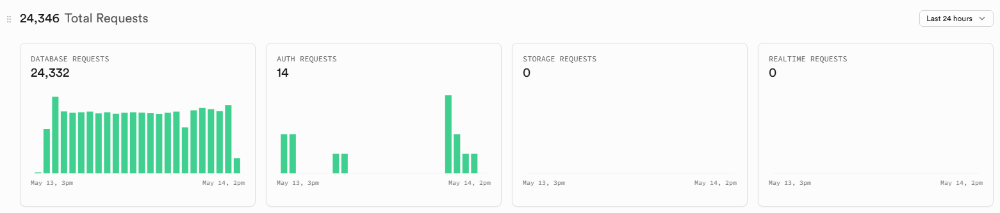

# 🏎️ BattleRace

3D 무한 질주 대결 게임 — Three.js 기반 브라우저 레이싱 게임 with 글로벌 랭킹

🔗 **플레이**: [battle-race.vercel.app](https://battle-race.vercel.app)

---

## 게임 소개

좌우 방향키로 장애물을 피하며 최고 점수를 달성하세요.  
전 세계 플레이어와 실시간 랭킹 경쟁!

### 조작법

| 키 | 동작 |
|---|---|
| `←` / `→` | 좌우 이동 |
| 모바일 | 화면 왼쪽/오른쪽 탭 |

### 장애물 종류

| 색상 | 종류 | 효과 |
|---|---|---|
| 🔴 빨간색 | 일반 장애물 | 충돌 시 게임 오버 |
| 🟣 보라색 | 유도형 장애물 | 플레이어 추적, 충돌 시 게임 오버 |
| 🟡 노란색 | 가짜 코인 | 먹으면 3초간 조작 반전 |

---

## 차량 종류

게임 시작 시 랜덤으로 1개 배정됩니다.

| 차량 | 특징 |
|---|---|
| 🚗 사이버트럭 | 스테인리스 실버, 각진 웨지 디자인 |
| 💗 바비카 | 핫핑크 컨버터블, 크롬 범퍼 & 테일핀 |
| 🐱 고양이 트럭 | 귀여운 박스카 + 지붕에 치즈냥이 탑승 |

---

## 기술 스택

| 분류 | 기술 |
|---|---|
| 프론트엔드 | Three.js (3D 렌더링), Vanilla JS |
| 백엔드 | Node.js + Express |
| 데이터베이스 | Supabase (PostgreSQL) |
| 배포 | Vercel |

---

## 아키텍처

```
브라우저 (Three.js 게임)
    ↕ REST API
Node.js / Express (Vercel Serverless)
    ↕ supabase-js
Supabase PostgreSQL
```

### 점수 등록 보안

- **HMAC 서명 토큰**: 게임 시작 시 서버가 서명된 세션 토큰 발급
- 서버리스 환경에서도 메모리 상태 없이 서명만으로 검증
- 이름당 **최고 점수 1개**만 저장 (upsert)

---

## DB 스키마

```sql
CREATE TABLE scores (
  id         uuid DEFAULT gen_random_uuid() PRIMARY KEY,
  name       text NOT NULL UNIQUE,
  score      integer NOT NULL,
  created_at timestamptz DEFAULT now()
);
```

---

## Supabase 현황

배포 직후 24시간 동안 **24,332건**의 DB 요청 발생



---

## 로컬 실행

```bash
git clone https://github.com/404h1/BattleRace.git
cd BattleRace

npm install

# .env 파일 생성
cp .env.example .env
# SUPABASE_URL, SUPABASE_SERVICE_KEY, SESSION_SECRET 입력

npm start
# → http://localhost:3000
```

---

## 환경변수

| 변수 | 설명 |
|---|---|
| `SUPABASE_URL` | Supabase 프로젝트 URL |
| `SUPABASE_SERVICE_KEY` | Supabase service_role 키 |
| `SESSION_SECRET` | HMAC 서명용 시크릿 |
